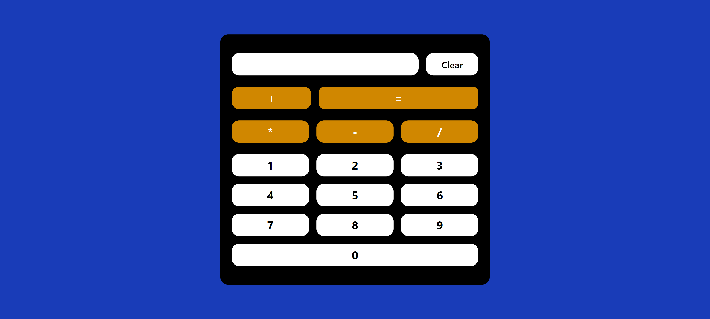
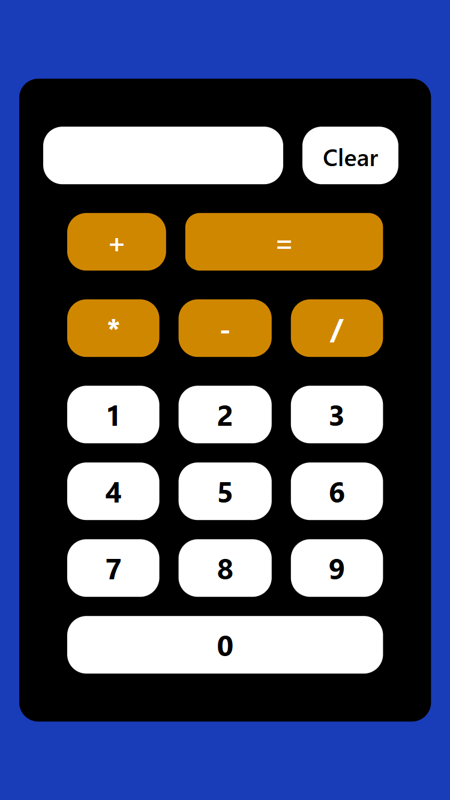

# Responsive Calculator App

A fully responsive calculator built with React and styled using Tailwind CSS. This calculator allows users to perform basic arithmetic operations with a clean, modern UI that works on all screen sizes — mobile, tablet, and desktop.

## Features

Built using React functional components and hooks (useState)

- 🎨 Styled with Tailwind CSS (fully responsive)

- ✅ Supports +, -, \*, and / operations

- 💡 Simple and readable codebase

- 📱 Mobile-first responsive layout

## Tech Stack

- **React**
- **Tailwind CSS**
- **Vite (for fast dev envirnment)**

⚠️ **Note**:
This calculator uses eval() for simplicity, which is not recommended in production due to potential security issues. In a production-grade app, consider using a proper math parser like mathjs.

## Screenshots

- Large Screen
  

- Small Screen
  

## Demo Link

[live Demo]()
